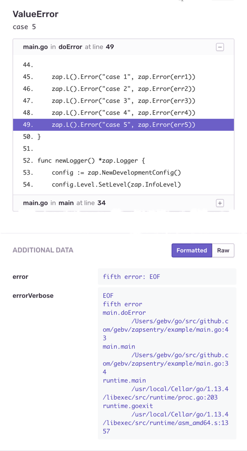

# Sentry client for zap logger

Zap Core for Sentry


[](https://goreportcard.com/report/github.com/gebv/zapsentry)


* [Features](#features)
* [Quick start - Installation](#installation)
* [Example code](#example-code)
* [Example of error and visualization in the Sentry UI](#example-of-error-and-visualization-in-the-sentry-ui)
* [Version Policy](#version-policy)
* [Licence](#license)


## Features

* with stacktrace (this is handy for analysis into Sentry UI)
* with tests (can always be tests)
* easy setup

# Quick start

## Installation

Using [go mod](https://github.com/golang/go/wiki/Modules):

```bash
go get github.com/gebv/zapsentry/v2
# update
# go get -u github.com/gebv/zapsentry/v2
```

## Example code

```go
// you already have a logger
//
// config := zap.NewDevelopmentConfig()
// config.Level.SetLevel(zap.InfoLevel)
// l, _ := config.Build(zap.AddStacktrace(zap.ErrorLevel))

zaplog, _ := zapsentry.Set(l,
    // required sets level enabler
    zapsentry.LevelEnabler(zap.ErrorLevel),
    // required sets DSN to Sentry and sets tags if need
    zapsentry.WithSentry("https://...", map[string]string{
        "tag1": "tag1-value",
        "tag2": "tag2-value",
    }),

    // (optional) set the number of layers to skip (first layers are always the same)
    zapsentry.TraceSkipFrames(3), // skip 3 first layers in stacktraces
    // (optional) set your enviroment
    zapsentry.Enviroment("dev"),
    // (optional) set your application version
    zapsentry.Release("v1-demo"),
    // we recommend enable stektrace
    zapsentry.EnableStacktrace(),
    // (optional) set your server name
    zapsentry.ServerName("my-server-name"),
)

// zap.ReplaceGlobals(zaplog)
```

## Example of error and visualization in the Sentry UI

```go
err1 := io.EOF
err5 := errors.Wrap(err1, "fifth error")

zap.L().Error("case 5", zap.Error(err5))
```

The most interesting:
- stacktrace
- error details (section `ADDITIONAL DATA`)



See a [complete example](example/README.md)

# Version Policy

`zapsentry` follows semantic versioning for the documented public API on stable releases. `v2` is the latest stable version and follows [SemVer](http://semver.org/) strictly. Follows [changelog](./CHANGELOG.md).

The library `v1` after improved and finalized went into `v2`. `v2` has a module name `github.com/gebv/zapsentry/v2`
`v1` follows [TheZeroSlave/zapsentry](https://github.com/TheZeroSlave/zapsentry).

# License

MIT, see [LICENSE](./LICENSE).
