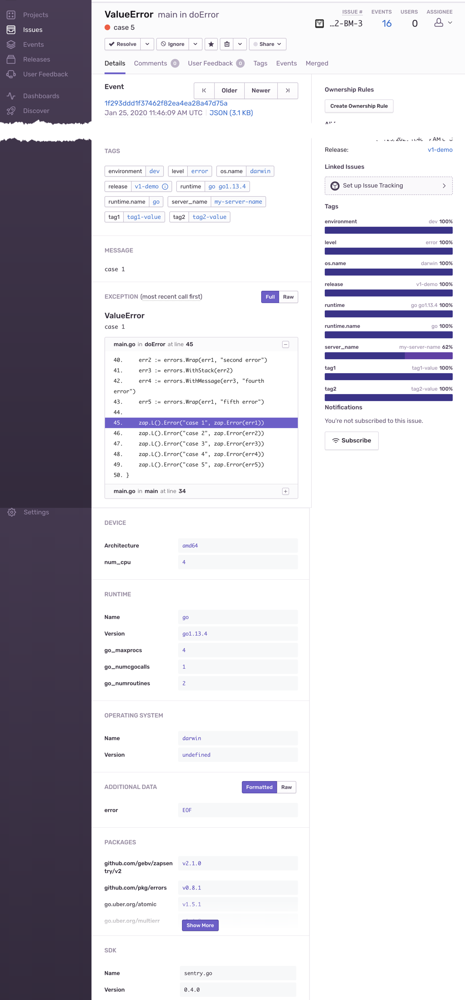
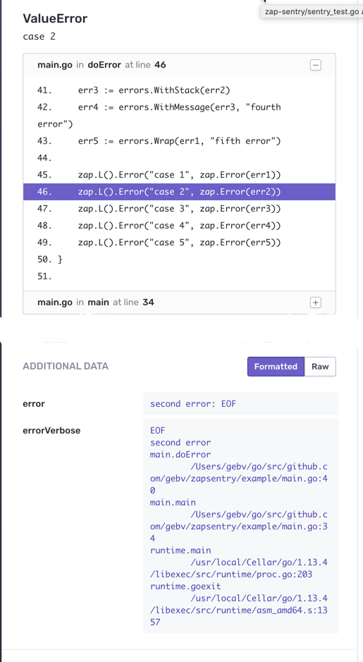
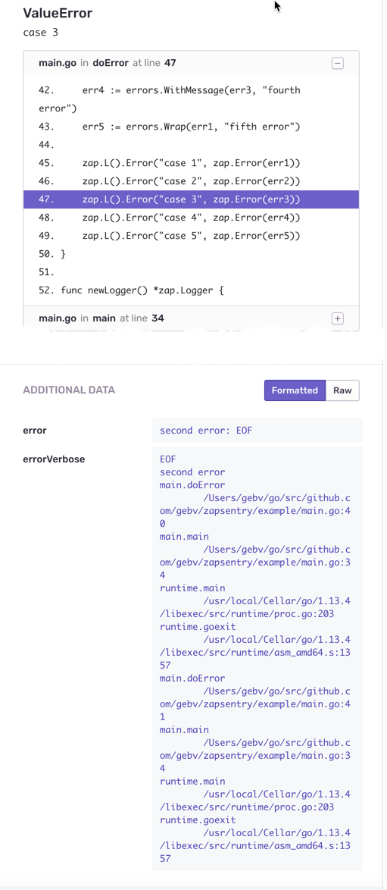
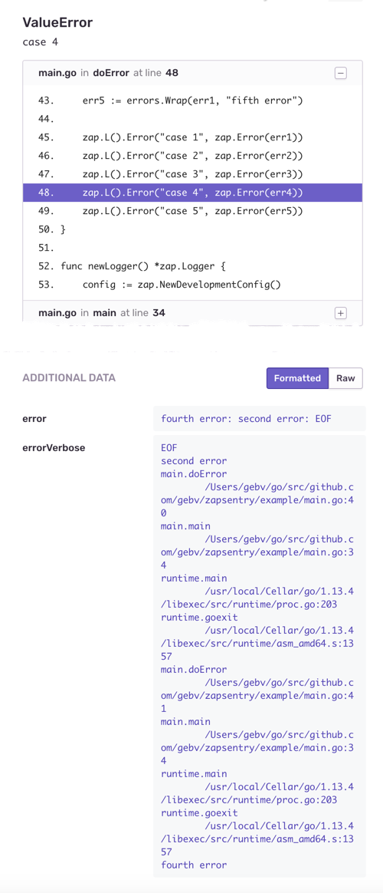
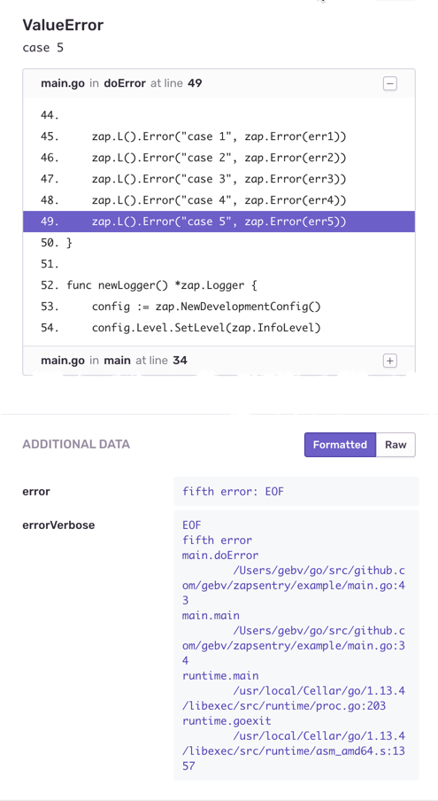

# Complete example

Complete example with screenshots from Sentry UI.

```go
package main

import (
	"io"
	"log"
	"time"

	"github.com/pkg/errors"
	"go.uber.org/zap"
	"github.com/gebv/zapsentry/v2"
)

func main() {
	l := newLogger()
	zaplog, err := zapsentry.Set(l,
		zapsentry.LevelEnabler(zap.ErrorLevel),
		zapsentry.WithSentry("https://...", map[string]string{
			"tag1": "tag1-value",
			"tag2": "tag2-value",
		}),

		zapsentry.TraceSkipFrames(3), // skip 3 first layers in stacktraces
		zapsentry.Enviroment("dev"),
		zapsentry.Release("v1-demo"),
		zapsentry.EnableStacktrace(),
		zapsentry.ServerName("my-server-name"),
	)
	if err != nil {
		log.Fatalln(err, "failed build zap logger with sentry")
	}
	setLogger(zaplog)
	doError()
	time.Sleep(time.Second * 5)
}

func doError() {
	err1 := io.EOF
	err2 := errors.Wrap(err1, "second error")
	err3 := errors.WithStack(err2)
	err4 := errors.WithMessage(err3, "fourth error")
	err5 := errors.Wrap(err1, "fifth error")

	zap.L().Error("case 1", zap.Error(err1))
	zap.L().Error("case 2", zap.Error(err2))
	zap.L().Error("case 3", zap.Error(err3))
	zap.L().Error("case 4", zap.Error(err4))
	zap.L().Error("case 5", zap.Error(err5))
}
```

[See full code](main.go)

Further details about the error into Sentry UI.

List issues
- all key information in one place


Event overview.



The most interesting:
- stacktrace
- error details (section `ADDITIONAL DATA`)

Case 2



Case 3



Case 4



Case 5


